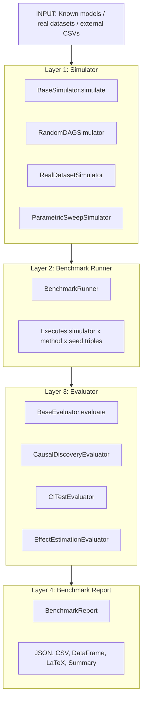

# causal-bench

A composable benchmarking framework for causal discovery algorithms and conditional independence tests, built on top of [pgmpy](https://pgmpy.org/).

This project is being developed as part of **Google Summer of Code 2026**.

---

## Mission Statement

Build `pgmpy.benchmark` — a composable, reproducible benchmarking module that sits inside the pgmpy library and eliminates the need for every researcher to write their own simulation, execution, and evaluation boilerplate. A full benchmark must be expressible in 10 lines of Python or less.

## Architecture

The framework is organized as four composable layers. Swapping any layer requires implementing exactly one method.



## Module Structure

```text
pgmpy/
└── benchmark/
    ├── __init__.py               # Public API exports
    ├── simulators/
    │   ├── __init__.py
    │   ├── base.py               # BaseSimulator ABC + GroundTruth dataclass
    │   ├── random_dag.py         # RandomDAGSimulator
    │   ├── real_dataset.py       # RealDatasetSimulator
    │   └── parametric_sweep.py   # ParametricSweepSimulator
    ├── runner.py                 # BenchmarkRunner + ResultRecord
    ├── evaluators/
    │   ├── __init__.py
    │   ├── base.py               # BaseEvaluator ABC
    │   ├── causal_discovery.py   # CausalDiscoveryEvaluator
    │   ├── ci_test.py            # CITestEvaluator
    │   ├── effect_estimation.py  # EffectEstimationEvaluator
    │   └── registry.py           # @register_evaluator decorator
    └── report.py                 # BenchmarkReport

notebooks/
    ├── 01_causal_discovery_comparison.ipynb
    ├── 02_ci_test_power_analysis.ipynb
    └── 03_effect_estimation_census.ipynb

docs/
    └── benchmark/
        ├── index.rst
        ├── simulators.rst
        ├── runner.rst
        ├── evaluators.rst
        └── report.rst

tests/
    └── benchmark/
        ├── test_simulators.py
        ├── test_runner.py
        ├── test_evaluators.py
        ├── test_report.py
        └── conftest.py
```

## Supported Tasks and Methods

| Task | Target Methods | Evaluator |
|---|---|---|
| Causal Discovery | PC, GES, MMHC, ExactSearch | `CausalDiscoveryEvaluator` |
| CI Testing | Chi-Square, G-Test, Fisher Z, KCI | `CITestEvaluator` |
| Effect Estimation | CausalInference | `EffectEstimationEvaluator` |

## Key Features

- **Combinatorial Execution Engine:** Executes every combination of simulator, method, and seed with error handling and wall-clock timing.
- **Parallelism:** Executes tasks concurrently via joblib (loky backend) to bypass pickling issues and race conditions.
- **Graceful Error Handling:** Full tracebacks are recorded without failing the entire run if a method times out or fails to converge.
- **Reproducible Exports:** Output full reproducible experiment records to JSON, summarizing seed, runtime, system info, and component configurations.

## Installation

```bash
# Editable install for development
pip install -e ".[dev]"
```

## Quick Start

```python
from pgmpy.benchmark import BenchmarkRunner, RandomDAGSimulator, CausalDiscoveryEvaluator
from pgmpy.estimators import PC, GES, MMHC

# 1. Setup
runner = BenchmarkRunner(
    simulators=[RandomDAGSimulator(n_nodes=10, edge_density=0.3)],
    methods=[PC(), GES(), MMHC()],
    evaluators=[CausalDiscoveryEvaluator()],
    n_seeds=20,
    n_jobs=4,
)

# 2. Run
report = runner.run()

# 3. Analyze
report.summary()                      # method x SHD/F1 table (mean +/- std)
report.to_json("results.json")        # reproducible record
df = report.to_dataframe()            # flat pandas DataFrame for plotting
```

## Development

```bash
pytest          # run tests
ruff check src  # lint
mypy src        # type-check
```